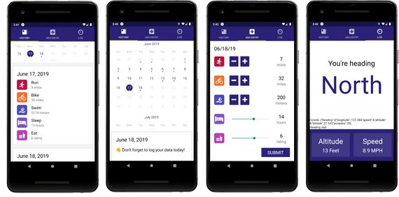

# UdaciFitness

UdaciFitness is a Triathlon Tracking App for iOS and Android built with React Native.



It uses Geolocation and allows users to track activity in following categories:

- Run
- Bike
- Swim
- Sleep
- Eat

It is built with React Native, Expo, Redux, & React Navigation and was built with knowledge gained from [Udacity's React Nanodegree program](https://www.udacity.com/course/react-nanodegree--nd019).

- Live Demo: [UdaciFitness on Expo](https://expo.io/@james-priest/reactnd-udacifitness)
- Course Notes: [Step-by-step walk-though of how this project was built](https://james-priest.github.io/udacity-nanodegree-react/course-notes/react-native.html)

## Installation

Clone the repository, change directories, and use npm or yarn to install the dependencies.

```bash
$ git clone https://github.com/james-priest/reactnd-udacifitness.git
$ cd reactnd-udacifitness
$ yarn
```

## Usage

The project can be run with npm or yarn

- `yarn start`

This will open Expo Developer Tools in the browser.  You can then do one of the following.

- Use your device to test:

    Scan the QR Code using the Expo Client app ([Expo Client for Android & iOS](https://expo.io/tools#client))  from an Android or iOS device.
- Use an Android Emulator or iOS Simulator to run the app:
    - [iOS Simulator Setup](https://docs.expo.io/versions/v33.0.0/introduction/installation/#ios-simulator)
    - [Android Emulator Setup](https://docs.expo.io/versions/v33.0.0/introduction/installation/#android-emulator)

## Testing

This project has been tested on the following platforms:

- iOS 11+
- Android 9+.